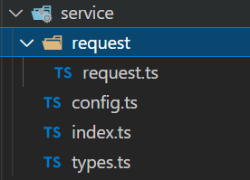

<!--truncate-->

Axios 是一个基于 promise 的 HTTP 库，可以用在浏览器和 node.js 中，也被 Vue 官方推荐用于作请求库来使用，本文根据曾经项目里的实际需求和结合文章阅读做出的 axios 封装，以下是文件结构
。

鉴于类具有更好的封装性质，所以使用 class 来封装。

## 通用拦截器封装

通用拦截器说明每一个实例化的请求都具有这个通用的拦截器，因此需要在 constructor 内部实现，实例化 axios 后直接挂载对应的拦截器。用于所有 http 请求都需要的通用拦截。

- 用于登录失效后刷新登录：响应拦截器
- 用于实现全局请求的 load 效果：请求拦截、响应拦截

```ts
class MyRequest {
  service: AxiosInstance;
  constructor(config: AxiosRequestConfig) {
    this.service = axios.create(config);
    this.service.interceptors.request.use(
      (config: AxiosRequestConfig) => {
        // console.log("所有实例都请求拦截成功");
        return config;
      },
      (err: any) => {
        // console.log(err, "所有实例都请求拦截失败");
        return Promise.reject(err);
      }
    );
    this.service.interceptors.response.use(
      (res: AxiosResponse) => {
        // console.log(res, "公共响应拦截成功");
        return res.data;
      },
      (err) => {
        return Promise.reject(err);
      }
    );
  }
}
```

## 特殊拦截器封装

对于不同的服务器配置的 axios 可能需要有对应特殊的拦截需要在传入实例时进行配置，所以对传入的 config 进行扩展，支持传入特殊的请求拦截和响应拦截。

```ts
interface Interceptors {
  requestSuccess?: (config: AxiosRequestConfig) => AxiosRequestConfig;
  requestErr?: (err: any) => any;
  responseSuccess?: <T = AxiosResponse>(res: T) => T;
  responseErr?: (err: any) => any;
}

interface RequestConfig extends AxiosRequestConfig {
  interceptors?: Interceptors;
  successMsg?: string;
}
```

同样的对于整个向服务器发送请求的拦截也是在实例化的瞬间就完成，故而也是封装在 constructor 内部的。

```ts
class MyRequest {
  service: AxiosInstance;
  constructor(config: RequestConfig) {
    this.service = axios.create(config);
    this.service.interceptors.request.use(
      (config: AxiosRequestConfig) => {
        // console.log("所有实例都请求拦截成功");
        return config;
      },
      (err: any) => {
        // console.log(err, "所有实例都请求拦截失败");
        return Promise.reject(err);
      }
    );
    // 不同实例的请求拦截器
    this.service.interceptors.request.use(
      config.interceptors?.requestSuccess,
      config.interceptors?.requestErr
    );
    this.service.interceptors.response.use(
      (res: AxiosResponse) => {
        return res.data;
      },
      (err) => {
        return Promise.reject(err);
      }
    );
    // 不同实例的响应拦截器
    this.service.interceptors.response.use(
      config.interceptors?.responseSuccess,
      config.interceptors?.responseErr
    );
  }
}
```

## 单个请求的拦截

对于某些单个请求有时候需要做定制化的需求，比如说单独需要查看某个请求的进度条的使用情况，就需要对单个请求进行拦截。
单个请求的拦截就必须对 axios 的 request 请求进行拦截，需要单独封装实现方法。对于单个请求 axios 没有直接提供对应的拦截器 api 函数，需要自己实现。

- 请求拦截本质上是在真正请求发生前对 config 做的操作，这里的方法本就是在请求发生前执行的操作，故而只需在 axios 的 request 方法执行前对 config 进行操作即可。
- 响应拦截：只需在获取响应后对其修改后再传递出去即可，这时需要借助 Promise,封装请求函数的时候返回 Promise，将修改好的 res 值在 resolve 出去即可实现响应拦截的效果。

```ts
request<T = IMyResponse>(config: RequestConfig): Promise<T> {
    // 这个return才是真正执行请求，在执行请求前进行请求拦截--目的就是改变config
    if (config?.interceptors?.requestSuccess) {
      config = config.interceptors.requestSuccess(config);
    }
    return new Promise((resolve, reject) => {
      this.service
        .request<any, T>(config)
        .then((res) => {
          // 响应成功的拦截
          if (config.interceptors?.responseSuccess) {
            res = config.interceptors?.responseSuccess<T>(res);
          }
          resolve(res);
        })
        .catch((err: any) => {
          if (config.interceptors?.responseErr) {
            err = config.interceptors?.responseErr(err);
          }
          reject(err);
        });
    });
  }
```

## axios 配置和导出

建议配置文件和导出文件分离，有助于后续修改。

- 配置文件提供 axios 通用配置比如 baseUrl timeout 等
- 导出文件暴露配置好的 axios 和通用的请求方法便于下一步单个请求函数的封装

```ts
// config
const BASE_URL = "http://example.com";
export const config: RequestConfig = {
  baseURL: BASE_URL,
  timeout: 1000 * 60 * 5,
  interceptors: {
    requestSuccess: (config) => {
      console.log("特有的请求拦截成功");
      return config;
    },
    requestErr: (err: any) => {
      console.log(err, "特有的请求拦截失败");
    },
    responseSuccess: (res) => {
      console.log("特有的响应拦截成功", res);
      return res;
    },
    responseErr: (err: any) => {
      console.log("特有的响应拦截失败", err);
    },
  },
};
```

```ts
// 完整的接口返回成功的话一般返回以下四个参数
export interface IMyResponse<T = any> {
  code: number;
  message: string;
  data: T;
  success: boolean;
}
interface ImyRequest<T> extends RequestConfig {
  // RequestConfig里有data，这里再写一次是为了使用传入泛型的方法来约束data类型
  data?: T;
}
const service = new MyRequest(instanceConfig);
// 该请求方式默认为GET，且一直用data作为参数(条件解决了)；
// T是真正的请求函数发出的参数的类型
// V是请求返回体的data的类型
export function myRequest<T, V = any>(config: ImyRequest<T>) {
  const { method = "GET" } = config;
  if (method === "get" || method === "GET") {
    config.params = config.data;
  }
  return service.request<IMyResponse<V>>(config);
}
```

## 函数级 api 封装

对于 API 的封装建议使用单独的 API 文件夹管理，不同模块单独文件夹管理，每个页面单独 ts 文件管理，这样具体使用的时候直接引用对应的方法即可

```ts
import { myRequest } from "../service";
import { IUserInfo } from "../store/types";

export interface requestParams {
  username: string;
  password: string;
}
export interface Res {
  token: string;
  nickName: string;
  userId: number;
  username: string;
}
export function login(params: requestParams) {
  return myRequest<requestParams, Res>({
    url: "/login/login",
    params,
    method: "post",
    successMsg: "登录成功",
  });
}
```
