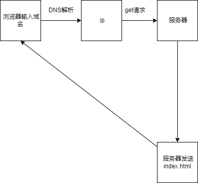
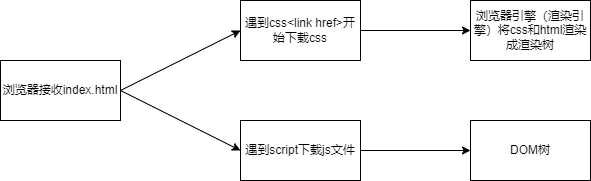
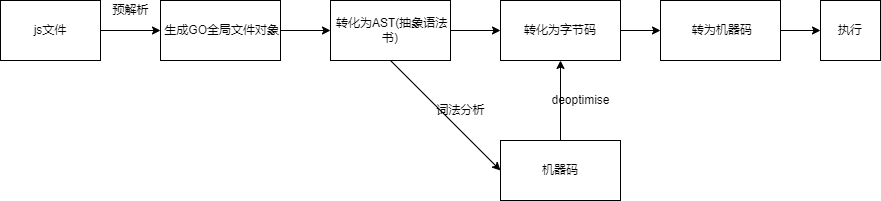

<!--truncate-->

## 浏览器输入 URL 的基本过程

传统的 SSR：用户在浏览器输入 url，经过 DNS 服务器解析为 ip 地址，向服务器发送 GET 请求，服务器最终返回 index.html 这个文件给客户端也就是浏览器
工作原理见下图



## 浏览器解析 HTML 的过程

浏览器并不是获得 index.html 就立即下载了对应的 css 文件`<link href></link>`，js 文件`<script src><script>`，而是随着 index.html 的一行一行的执行遇到了对应的 link 标签和 script 标签才开始向服务器下载这些资源。css 和图片视频等都属于静态资源。浏览器的引擎分为两部分，一部分是渲染引擎，一部分是 js 引擎，渲染引擎待 css 和 html 整合成渲染树以后，将此渲染到页面上。js 引擎负责处理的就是将 js 代码转为机器码在 CPU 中最后执行的过程。解析过程见下图



## js 引擎解析 js 过程

常用的 js 引擎就是 chrome 的 v8 内核，这里以 v8 内核指代。


v8 内核先对 js 文件进行预解析，生成 GO 对象(GlobalObject)，存放 js 内置的对象比如说 String Date 以及 js 文件中初始化的变量，比如说`var name = "hhhh"`中的 name 变量等（注意这时候 js 还并没有执行，因此还没有进行赋值操作，故而此时 name 的值为 undefined---这就是变量提升的来源）。生成全局的 GO 之后将 js 文件的代码转为 AST（抽象语法树）[^1],为了跨平台的需求会将 AST 转化为字节码[^2]，再转为机器码，最终执行，但是 V8 引擎为了做到高效的执行，在预解析形成 GO 全局对象的阶段时将所有存在的变量已经存储于 GO 中，在 AST 转化时进行词法分析，对于高频使用的函数，会进行直接转化为机器码，这样再以后执行的时候直接调用机器码执行，性能会大幅度提升。注意到有时候直接转为机器码之后反而又转为了字节码是因为以下原因：以前执行一直都是两个数相加，一直使用机器码没有问题，但是一旦输入两个字符串之后，这就会发生改变所以就有了 deoptimise 的过程

```js
const sum = (a, b) => {
  return a + b;
};
```

[^1]: Vue 中的 template 模板引擎也是转为 ast 的
[^2]: mac linux windows 的 cpu 执行指令不同，即同一段程序的机器码不同，故而先转化为字节码再转为机器码来实现跨平台
