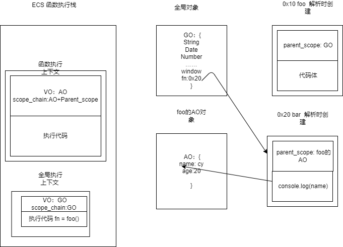

<!--truncate-->

## 前置

本文是从内存管理的角度来理解闭包的，因此会有一些前置知识需要建立

### js 运行原理

js 是一门解释执行语言，因此在执行前会进行解释，解释完成后才会执行，注意它并不是等所有的代码都解释完后才执行的，而是边解释边执行的。

- 对于下文代码，js 先只会解释 foo 函数和 fn 变量，然后执行 foo 函数，执行 foo 函数过程中遇到 bar 函数，再解释 bar 函数，进而执行，并不是把 foo bar fn 都解释完成后再执行代码
  ```ts
  function foo() {
    var age = 18;
    function bar() {
      var name = "sunshine";
      return name;
    }
    return bar;
  }
  var fn = foo();
  fn();
  ```
- 解释变量的过程，就是给变量赋值了一个 undefine 值，之后执行的时候才会进行真正的赋值操作
- 解释函数的过程，遇到函数，会在堆内存上创建内存空间，内存空间上存储两部分内容，第一个是函数的 parent_scope(父级作用域)，另一个是函数的执行代码。<font color="red">也就是说函数的父级作用域是在函数定义的时候指明，而不是函数调用的时候确定。</font> foo 函数定义的时候的作用域是全局，故打印的 foo 而不是 bar
  ```ts
  var name = "foo";
  function foo() {
    console.log(name);
  }
  function bar() {
    var name = "bar";
    foo();
  }
  bar(); // foo
  ```
- js 代码在具体执行的过程中，会运行在函数执行栈里，处于全局的变量和函数运行在全局执行上下文，每一个具体函数中运行的是函数执行上下文，每一个执行上下文由三部分构成，VO:变量对象，scope_chain:作用域链由自己的 VO 对象和父级作用域确定，以及执行时运行的执行代码(前两者解析函数时确定，后者执行时确定)。
- js 查找变量是按照作用域链查找的

## 闭包运行分析

```ts
function foo() {
  var name = "cy";
  var age = 24;
  return function bar() {
    console.log(name);
  };
}
var fn = foo();
fn();
```

上面的代码 name 和 function bar 就构成了一个闭包，具体的运行过程见下图.

1. 函数全局解析时，遇到 函数 foo 时会在堆上创建 foo 对象，对象存储了 foo 的父级作用域也就是全局作用域 GO(Global Object) 和代码体 <font color = "red">定义函数时确定父级作用域</font>，遇到 fn 的时候进行解析，在 GO 对象上添加属性 fn 值为 undefined

2. 解析完毕执行代码，执行 foo 函数，执行函数会创建函数执行上下文，并将执行上下文入函数执行栈，函数执行栈里确定 VO(Variable Object)：也就是当前函数内部的变量对象，取名叫激活对象 AO(Active Object),开始解析函数内部变量，AO 解析时 name 和 age 都是 undefined,遇到 function bar 继续解析在堆上开辟内存空间地址是 0x20，确定父级作用域 foo 的 AO，和代码体。
3. 执行 foo 内部代码进行赋值操作 foo AO 中的 name 和 age 变为“cy” 和 24,返回 bar 函数给全局里的 fn，实际返回的是函数在堆上的地址，故而 GO 中的 fn 就变成了 0x20,foo 函数执行完毕，出栈，foo 的执行上下文销毁。<font color = "red">这时候 foo 的 AO 并没有销毁,因为解析函数时 bar 的 parent_scope 引用这 foo 的 AO</font>。
4. 继续执行 fn()，创建函数执行上下文，AO 是 bar 自己的包括传递的实参和自己内部的变量，scope_chain 是 bar 的 AO+parent_scope:foo 的 AO 。解析完毕开始执行代码 `console.log(name)` name 变量沿着作用域链查找，bar 的 AO 上没有，就往上查找在 foo 的 AO 上查找，继续往上找，找到 GO 没有就会报错，这里找到 foo 的 AO 上就找到了就直接打印出来了。函数执行完毕函数出栈。

5. 这里 bar 函数和外层的 name 就构成了闭包。

也就是说：js 中的函数如果访问了外层作用于的变量，那它们就构成了一个闭包。

## 内存泄漏

闭包往往很容易引起内存泄漏，继续以上文的例子为例，上面的代码执行完毕后，GO 中的 fn 持续引用这 bar 函数，bar 持续引用这 foo 的 AO，如果 js 中类似这样的引用很多，垃圾回收不能回收，就会造成内存泄漏的问题，因此为了解决这个问题，<font color = "red">对于不使用的函数，将其引用赋值为 null</font>，这样 bar 的引用消失，bar 就会在下次垃圾回收时销毁，接着 foo 的 AO 也就销毁了。

注意： 上文例子中 V8 对闭包也有优化，foo 中 AO 的 name 保留了，age 由于没有被使用，V8 将其销毁了以节约性能。
