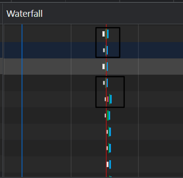

<!--truncate-->

本文仅整体一些本人之前不曾了解过的 chrome 调试技巧

## Elements

1. 调试样式：先选中对应调试的元素
2. 样式区选中.cls 动态选中需要选择的类
3. 选中:hover 区域，只调试伪类选择器对应的 css 效果
4. 选中 computed 计算区的 filter 进行快速筛选某个属性，筛选到对应的属性后选中旁边的小箭头可以快速跳转到 styles 区域下的类下面的样式
   

## Console

1. 不同类型的值，日志颜色不同，数值是紫色，字符串是青色
2. `console.table()` 打印数组和对象以表格方式展开便于观察
3. `console.dir()` 展开文件树结构，适合打印 DOM 节点上具有的属性
4. `console.error() console.warning()`较为显眼的日志打印技巧
5. 添加占位符实现某种样式打印控制台的结果

## Sources

1. 代码里直接写`debugger` 或者直接在 sources 面板下的 js 中选中具体的行，进行打断点，刷新浏览器进行 debugger.
2. 右侧的 watch 直接监视需要查看的变量
3. BreakPoints 有多个断点时可以快捷取消选中断点
4. Scope：作用域：可以观察函数执行作用域和闭包
5. callStack：函数执行栈
6. XHR/fetch BreakPoints 区域添加指定请求的 url,当请求发生的时候会触发断点
7. 线上代码调试技巧，打包的时候 webpack 开启 sourcemap，这样会生成 sourcemap，部署的时候只部署源代码，sourcesmap 文件存放到监控系统，这样线上报错的时候，监控系统会根据 sourcemap 指明源代码具体报错的代码行位置。
   - 也可以使用代理工具进行简单使用 sourcemap，代理工具将访问线上的 sourcemap 代理到本地的 sourcemap 上也可以进行线上调试。

## Network

1. waterfall 区域可以观察请求是否是串行还是并行执行,第一个标记区域发现对齐的，所以是并行请求，第二个选中区域是错开的，故而是串行请求
   

## Performance 、LightHouse

1. [chrome 提供的性能调试例子](https://googlechrome.github.io/devtools-samples/jank/)，在 performance 区域进行录制分析。

2. 以页面出现卡顿为例，录制后打开 Frames 下滑动鼠标滚轮明显发现掉帧现象，选中 Main 展开滑动滚轮放大后发现有红色区域，点击红色区域下面的 Summary 区域的 Callstacks 下会指出可能出现性能问题的文件，点击进行查看分析即可。

   .
   
   
   

3. LightHouse 是 performance 的“简洁版”，用可以量化的分数来评判网站的性能
